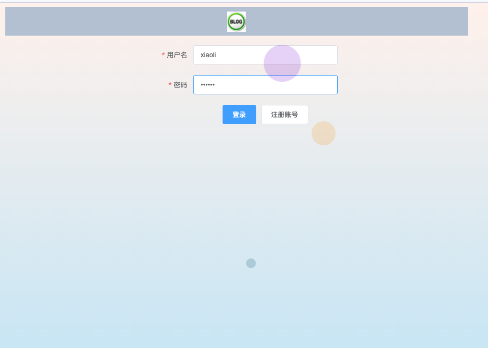
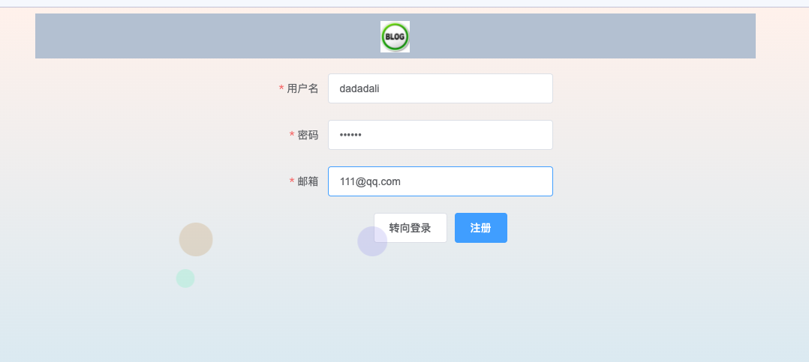
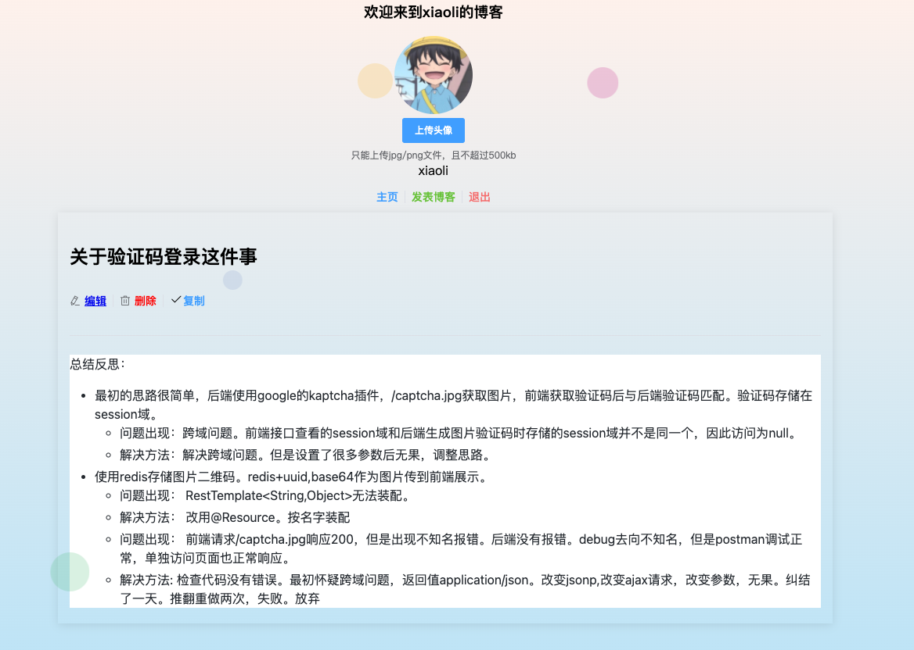
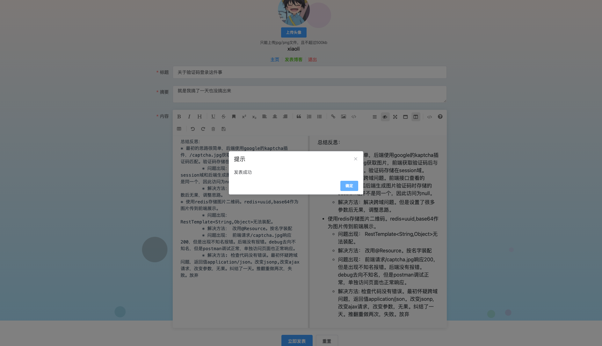
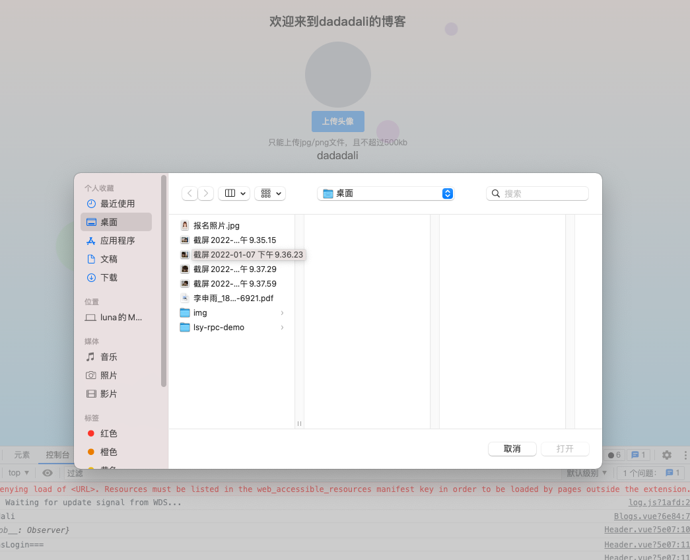
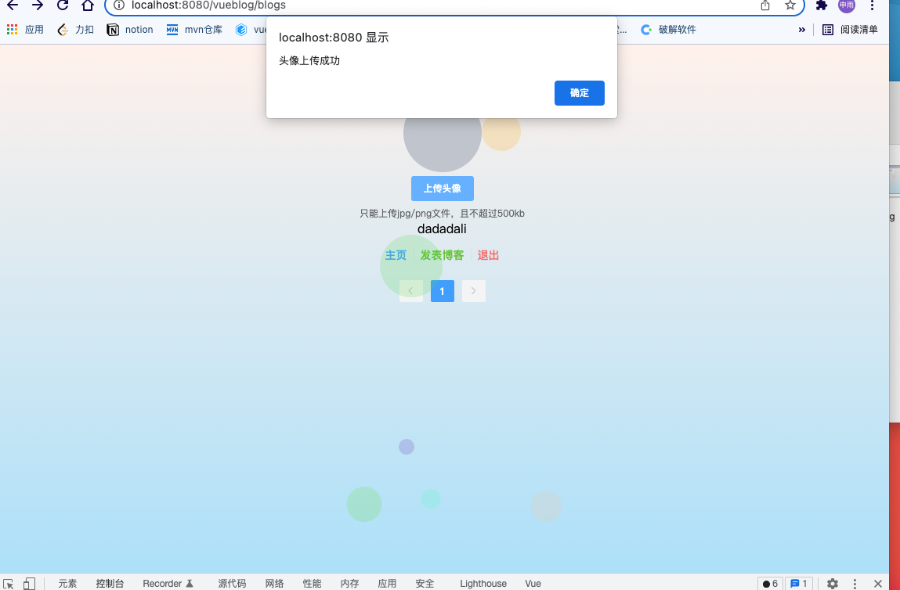
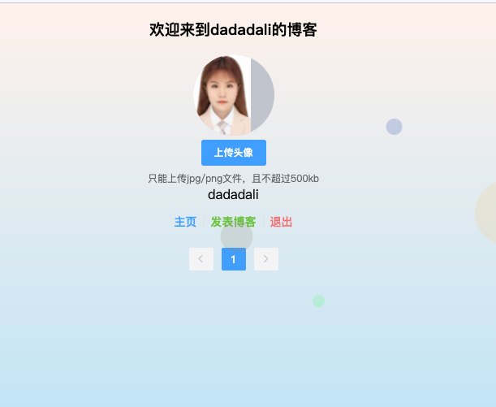
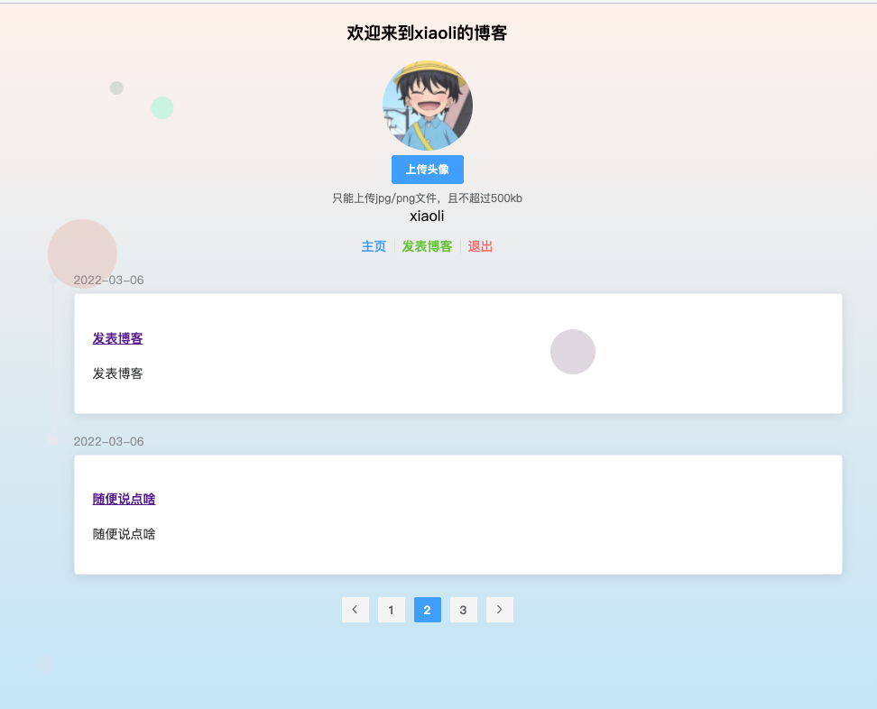

# blogSystem
## 基本介绍
简单的博客系统。
前端位于vue_before分支。
后端位于java_behind分支。

## 技术栈
### 前端
Vue+element-ui+axios
### 后端
springboot+mybatis-plus+redis+jwt+shiro

## 功能实现
- [√] 登录/注册

- [√] 查看博客

- [√] 退出用户

- [√] 发表/编辑/删除博客

- [√] 上传头像
  * 上传到阿里云oss中，将oss中对应的链接放在数据库中。
- [×] 博客中的图片上传
  * 类似于上传头像功能，可能涉及到base64的编码解码。
 

- [√] 复制全文

- [√] 分页

- [×] 短信+图片验证码注册/登录

  * 图片二维码
    * 
总结反思：
<ul><li>最初的思路很简单，后端使用google的kaptcha插件，/captcha.jpg获取图片，前端获取验证码后与后端验证码匹配。验证码存储在session域。<ul><li>问题出现：跨域问题。前端接口查看的session域和后端生成图片验证码时存储的session域并不是同一个，因此访问为null。</li><li>解决方法：解决跨域问题。但是设置了很多参数后无果，调整思路。</li></ul></li><li>使用redis存储图片二维码。redis+uuid,base64作为图片传到前端展示。<ul><li>问题出现： RestTemplate&lt;String,Object&gt;无法装配。</li><li>解决方法： 改用@Resource。按名字装配</li><li>问题出现： 前端请求/captcha.jpg响应200，但是出现不知名报错。后端没有报错。debug去向不知名，但是postman调试正常，单独访问页面也正常响应。</li><li>解决方法: 检查代码没有错误。最初怀疑跨域问题，返回值application/json。改变jsonp,改变ajax请求，改变参数，无果。纠结了一天。推翻重做两次，失败。放弃</li></ul></li></ul>
    * 先准备面试，日后再解决。
- [×] 点赞/评论博客
